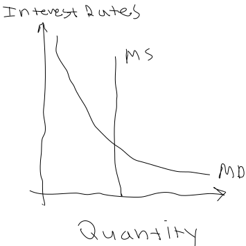

## Money Supply
- The **federal reserve** tries to change interest rates by manipulating **money supply**
    * **Money supply** = the total amount of currency in an economy
    * On the interest rates vs quantity graph, it is vertical
        + Similar to LRAS
    * The equilibrium point is where money demand(MD) and money supply(MS) intersect
    * This tool is called **monetary policy**
        + A right shift is an *increase* in the money supply
        + A left shift is a *decrease* in the money supply

### Money Supply and Aggregate Demand
- Because the demand for money(MD) is downward sloping, a change in money supply creates a new equilibrium point
    * The new interest rate will change the rate at which businesses invest
        + This shifts aggregate demand
- An increase in MS causes
    1. A lower equilibrium interest rate
    2. More investment
    3. Higher AD
    4. Lower unemployment
    5. Higher price level
- A decrease in MS causes
    1. A higher equilibrium interest rate
    2. Less investment
    3. Lower AD
    4. Higher unemployment
    5. Lower price level

### Fractional Reserve Banking
- **Fractional reserve banking** = the practice of banks using its customers deposits as the source for loans
    * Usually isn't a problem, because people only occasionally come to withdraw
        + But, if a massive recession hits, and everyone goes and demands their deposits, that would be a problem
            - This situation is called a **bank run**
    * Banks are required by law to hold at least some percentage of deposits available
        + This amount is called the **required reserves**
        + The remaining assets that can be loaned are called the **excess reserves**
- **Demand deposits** = an event where some economic entity deposits currency into a private checking account
    * Bank thinks to itself: *oooooooohh, I won't lend this to idiots.  Probably*
        + Really the bank planned on loaning it to idiots the whole time
- **Balance sheet** = a metric of the net wealth of a bank
    * Considers
        + Assets
        + Liabilities
        + Net worth

### Money Multiplier
- There's a money multiplier just like there is a spending multiplier
$$ Money\ Multiplier = \frac{1}{Reserve\ requirement} $$
