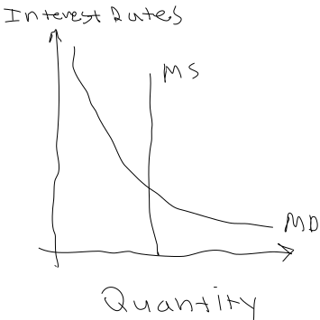

# 2017-03-20

## Why Do We Use Currency?
- Currency is a **medium of exchange**
    * This means that currency is the intermediate commodity between transactions
    * Instead of **bartering**, we can use currency for exchange
        + Problems with bartering
            1. **Double Coincidence of Wants** = both parties must actively want each others goods
                - Currency fixes this, as one person can desire a good, and the seller can desire the purchasing power associated with some amount of money
            2. Some goods cannot be split into smaller denominations
                - Currency fixes this by being offered in everything from pennies to hundred dollar bills
- **Wealth** = the totality of someone's assets
    * Assets include
        + Land
        + Capital
        + Labor power
            - *You damn commie*
- **Income** = the rate at which someone's wealth changes with time

### Commodity Currency vs Fiat Currency
- **Commodity currency** = a system of currency where the item of exchange has **intrinsic utility** to people
    * **Intrinsic utility** = a use or benefit that exists *within* the item of exchange
    * *e.g.*
        + Slips of paper that can be turned in at any time for food or water
        + Gold standard
            - The intrinsic utility of gold is doubtful, but I guess some people are stupid and like shiny things
- **Fiat currency** = a system of currency where the item of exchange has only **extrinsic utility** to people
    * **Extrinsic utility** = a use or benefit that exists *externally* to the item of exchange
        + This means that money is not useful in and of itself--aside from maybe warmth if you burn it
    * *e.g.*
        - Basically every modern economy(USD, Euro, British pound, etc)
        - I.O.U.'s

### Three Functions of Currency
1. **Medium of exchange** = the currency can be easily used to purchase goods and services
    *
2. **Unit of account** = producers use the currency to broadcast the prices of their goods or services
    * If all the shops are charging for sheckles, you're going to be justifiably confused
3. **Store of value** = the currency can be saved
    * Explains why spoilable goods do not make for good currency

### What Makes for a Good Currency?
1. **Widely accepted** = similar to the "unit of account" idea
    * Fiat currency is valuable if we all think it is
2. **Scarcity** = cannot be easily reproduced
3. Dividable into smaller denominations
- **Purchasing power** = the amount of goods and services a unit amount of currency can purchase
- **Inflation/Deflation** = the process of changing purchasing power with time
    * Can be caused by all kinds of things

### Liquidity
- **Liquidity** = the difficulty by which an asset can be used as a medium of exchange
- Three levels
    1. **M1(Highest liquidity)**
        * *e.g.*
            + Circulating currency
            + Checking accounts
    2. **M2(Near-Moneys)**
        * *e.g.*
            + All of M1
            + Invested currency
    3. **M3(Unliquid)**
        * *e.g.*
            + Assets that cannot be easily transfered

---

# 2017-03-21

### The Financial Sector
- **Financial sector** = a web of entitites that link people who want to borrow with people who want to lend
    * *e.g.*
        + Banks
        + Mutual funds
        + Pension funds
    * **Assets** = anything tangible or intangible that is owned
    * **Liability** = outstanding debts or obligations
    * **Loan** = an agreement between a lender and a borrower to give some assets from the lender to the borrower
        + Typically is associated with an **interest rate**

### Personal Finance vs Investment
- This class is focused on Macroeconomics, so **personal finance** isn't really covered
    * **Personal finance** = the method by which individuals and small economic units allocate assets to be spent and saved
- The business equivalent of spending is **investment**
    * This grows capital stock and increases real GDP

### Bonds vs Stock
- **Bond** = an agreement where individuals or small economic units lend assets to a larger institution(*e.g.* the government)
    * Owning a bond is like owning a promise that the money will be paid back in the future, with interest
    * These investments hold little risk, so their interest rate is smaller
        + If interest rate of bond market *decreases*, then demand for current bonds will decrease, and older bonds will raise in demand
    * Bonds do **not** transfer a stake in the organization
        + Rather, it's just debt
- **Stock** = an agreement where economic entities purchase a proportion of ownership of a private enterprise
    * This kind of investment is more risky
        + Because the company you are investing in could be successful or unsuccessful
    * Different from **bonds** because return on investment is not guaranteed
- **KEY POINT**: bond price and interest rates are inverseley related

### Time Value of Money
- Essential idea is that money *now* has a different value from money in the future
- This can be thought of in a few ways
    * **Interest rates**: there's an opportunity cost associated with using the money now rather than saving
    * **Human psychology**: I want it all and I want it now
        + *plz.*
- Present value of money
$$ Present\ Value = \frac{P}{(1 + R)^N} $$
- where $P$ is prinicple, $R$ is rate per compound iteration, and $T$ is the number of times that the principle compounds over the time period
- Future value of money
$$ Future\ Value = P (1 + R)^N $$
- where $P$ is prinicple, $R$ is rate per compound iteration, and $T$ is the number of times that the principle compounds over the time period

## Demand For Money
- **Transaction demand for money** = there is some level of current demand for everyday transactions
    * People need a medium of exchange for daily necessities
- **Asset demand for money** = there is some level of current demand for less liquid assets
    * This is because non-liquid assets are less risky
        + There is an inverse relationship between liquidity and risk

### Interest Rates and Demand For Money
- As interest rates increase, the opportunity cost of immediate consumption is higher
    * So, people invest in lower-liquidity assets
- As interest rates decrease, the opportunity cost of immediate consumption is lower
    * This is because putting away money to accrue interest won't give you much return
- In general, there is an inverse relationship between interest rates and quantity of money demanded
- Shifters of money demand curve
    1. Inflation/Deflation
        * If prices suddenly change, your saving habits change, and demand for money changes
    2. Changes in income
        * If income changes, your saving habits change, and demand for money changes
    3. Changes in technology

---

# 2017-03-22

## Money Supply
- The **federal reserve** tries to change interest rates by manipulating **money supply**
    * **Money supply** = the total amount of currency in an economy
    * On the interest rates vs quantity graph, it is vertical
        + Similar to LRAS
    * The equilibrium point is where money demand(MD) and money supply(MS) intersect
    * This tool is called **monetary policy**
        + A right shift is an *increase* in the money supply
        + A left shift is a *decrease* in the money supply

### Money Supply and Aggregate Demand
- Because the demand for money(MD) is downward sloping, a change in money supply creates a new equilibrium point
    * The new interest rate will change the rate at which businesses invest
        + This shifts aggregate demand
- An increase in MS causes
    1. A lower equilibrium interest rate
    2. More investment
    3. Higher AD
    4. Lower unemployment
    5. Higher price level
- A decrease in MS causes
    1. A higher equilibrium interest rate
    2. Less investment
    3. Lower AD
    4. Higher unemployment
    5. Lower price level

### Fractional Reserve Banking
- **Fractional reserve banking** = the practice of banks using its customers deposits as the source for loans
    * Usually isn't a problem, because people only occasionally come to withdraw
        + But, if a massive recession hits, and everyone goes and demands their deposits, that would be a problem
            - This situation is called a **bank run**
    * Banks are required by law to hold at least some percentage of deposits available
        + This amount is called the **required reserves**
        + The remaining assets that can be loaned are called the **excess reserves**
- **Demand deposits** = an event where some economic entity deposits currency into a private checking account
    * Bank thinks to itself: *oooooooohh, I won't lend this to idiots.  Probably*
        + Really the bank planned on loaning it to idiots the whole time
- **Balance sheet** = a metric of the net wealth of a bank
    * Considers
        + Assets
        + Liabilities
        + Net worth

### Money Multiplier
- There's a money multiplier just like there is a spending multiplier
$$ Money\ Multiplier = \frac{1}{Reserve\ requirement} $$

---

# 2017-03-24

## A Chain of Events: Changing the Money Supply
1. The fed makes the determination that it wants to change the money supply
2. It does this by selling or purchasing bonds
    * If it sells bonds, people and banks spend their own money to buy them, decreasing the money in circulation
    * If it buys bonds back from people and banks, those people and banks get more money, increasing the money in circulation
3. Becacuse the banks now have more(if the fed bought bonds back from them) or less(if the fed sold more to the banks), the banks change the interest rates at which they lend
    * In this class "interest rate" is kind of a shorthand for "interest rate at which banks loan"
        + It's *not* the interest rate for savings accounts
    * If the bank pays a lot for new bonds, then it has to raise their interest rates so they can maintain a profit
    * If the bank gets paid for bonds it previously owned, then it can be competitive with other banks by offering lower interest rates
4. Becuse interest rates for loans change, interest rates for savings accounts change
    * If loaning interest rates increase, savings interest rates will decrease
        + This is because both measures help to save money when the bank buys a lot of bonds and doesn't have a lot of money
    * If loaning interest rates decrease, savings interest rates will decrease
        + This is because both measures will help the bank be competitive with other banks for consumers
5. Because savings interest rate changes, spending habits change
    * If savings interest rate decreases, then consumers will spend more now and save less
        + This is because the interest they stand to gain by saving is *less* than the immediate utility of *buyin' things*!
    * If savings interest rate increases, then consumers will spend less now and save more
        + This is because the interest they stand to gain by saving is *more* thant he immediate utility of consumption
6. Because consumer spending habits change, aggregate demand changes
    * If spending decreases, AD decreases
    * If spending increases, AD increases
7. Because AD changes, price level changes
    * If AD decreases, price level decreases
    * If AD increases, price level increases
8. Because price level changes, demand for money changes
    * If price level decreases, demand for money decreases
        + This is because people need *less* money to buy the same things
    * If price level increases, demand for money increases
        + This is because people need *more* money to buy the same things
            - *MOAR. MOAR. MOARRRRRRRRR.*

### A Summary of Changes
- If money supply decreases, money demand decreases
- If money supply increases, money demand increases
- Isn't that a hell of a lot simpler?

### Three Shifters of the Money Supply
1. **Reserve requirements**
2. **Discount rates** = the rate at which the fed lends to banks
3. **Open market operations** = an action where the government sells government securities
    * **Government securities** = a financial object that the government owns
    * *e.g.*
        + Buying bonds
        + Selling bonds
